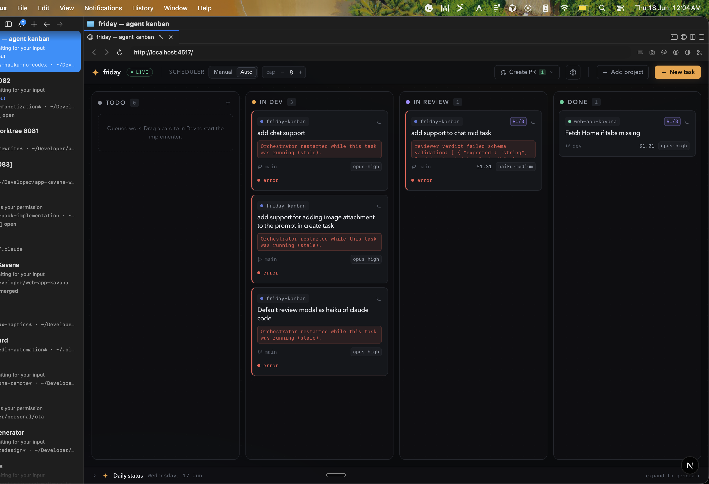
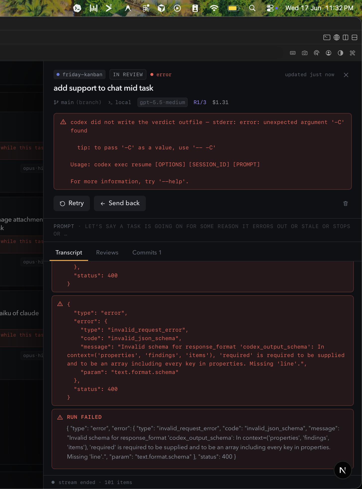

# friday-kanban

A local web app that runs a single kanban board across **all** your projects and drives AI
coding agents through it automatically:

```
Todo ──▶ In Dev ──▶ In Review ──▶ Done ───▶ (manual) Create PR
        Claude Code     Claude Code     commits on
        implements      reviews         the branch
                             │
                             └─ blocker found → back to In Dev (same Claude session, with the findings)
```



- **In Dev** is implemented by Claude Code (default: latest Opus, high effort).
- **In Review** is reviewed by Claude Code (Haiku, medium effort) for local tasks; cloud tasks are
  reviewed by the Codex CLI.
- If the reviewer flags a **bug or security** issue, the card bounces back to In Dev and the
  *same* Claude session is resumed with the findings. Style/nitpick comments never block.
- The loop is capped at **3 rounds**; if still blocked, the card goes to **Needs attention**.
- A stopped card (error / needs-attention) can be **retried**, or you can **send it a message** —
  free-form instructions handed to the agent in its existing session to steer the next run.
- **Done** means the task passed review and its commits are on the branch — there is **no PR per
  task**. A manual **Create PR** action per project bundles all done-task commits into one PR.

Tasks can run **locally** or in the **cloud** (`claude --remote`). See `DESIGN.md` for the full
list of locked design decisions and `docs/research/` for the research the design is based on.

Open a card to follow the live agent transcript, review rounds, findings, commits, and cost — and
to retry or message a stopped task:



## Prerequisites

- **Node.js 22+**
- **`claude`** (Claude Code CLI) — installed and authenticated (`claude` runs without prompting).
  Used for both the implementer and the local reviewer.
- **`codex`** (OpenAI Codex CLI) — optional; only required if you run **cloud** tasks, which use it
  as the reviewer.
- **`gh`** (GitHub CLI) — installed and authenticated, used to open PRs.
- **`git`** on PATH.

The agent CLIs are invoked as child processes from your PATH. Local tasks run with permissions
skipped (`claude --dangerously-skip-permissions`), so point friday-kanban at repositories you
trust — git history is your undo.

## Run

```bash
npm install
npm run dev      # custom server + Next.js + orchestrator, all in one process
```

Open **http://localhost:4517**.

`npm run build` produces a production build; `npm start` runs it.

## Using it

1. **Add Project** — give it a name and the local repo path. The base branch is auto-detected.
2. **New Task** — pick the project and branch (or create a new branch), write the prompt, attach
   any extra context paths or images, choose the workspace mode (work on the branch directly, in a
   git worktree, or on a fresh branch), pick local vs cloud, and optionally override the per-stage
   models/effort (prefilled from the column defaults).
3. **Start it** — drag the card from Todo → In Dev (manual mode), or flip the header toggle to
   **auto** and friday drains the Todo column itself, up to the concurrency cap (default 5).
4. Watch the live agent transcript by opening the card. Review rounds, findings, commits, and
   cost are all shown there.
5. If a card stops on an **error** or **needs-attention**, open it and either **Retry**, or type a
   message in the composer and **Send** — the agent resumes its session with your instructions.
6. When tasks are Done, use **Create PR** for the project to open a single bundled PR.

Dragging a card **is a command**: Todo→In Dev starts the implementer, In Dev→In Review forces a
review, In Review→In Dev sends it back with a comment. Illegal moves are rejected.

## Configuration & data

Everything lives under `~/.friday-kanban/`:

- `friday.db` — SQLite database (projects, tasks, the append-only event log, agent runs, PRs,
  status reports, config). Delete it to reset all state.
- `transcripts/` — raw NDJSON transcripts and review verdicts per agent run.
- `worktrees/` — git worktrees for tasks using worktree mode.

Board settings (scheduler mode, concurrency cap, review-cycle cap, per-column default models) are
editable from the UI and persisted in the database.

## Morning status pane

The collapsed pane at the bottom of the board summarizes each project's previous-day activity
(`git log` + the board's own task history, summarized by Haiku). It is generated on the first
board load of each day and cached per project per day.

## Notes

- The server owns all agent child processes; the browser receives live updates over an SSE stream
  (`/api/events`) and live per-task transcripts (`/api/tasks/[id]/transcript`).
- On startup, any task left in a `running` state by a previous crash is recovered to an error
  state so it can be retried.
- macOS desktop notifications fire when a task errors, exhausts the review cap, or finishes.
